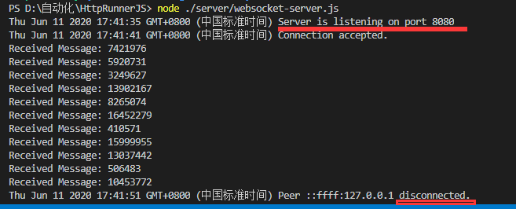
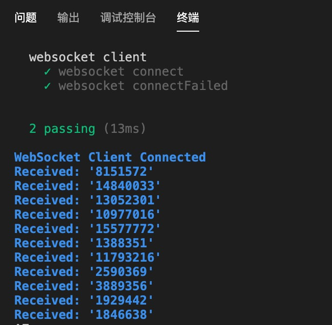
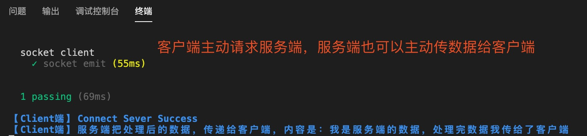
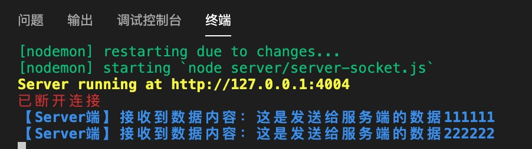
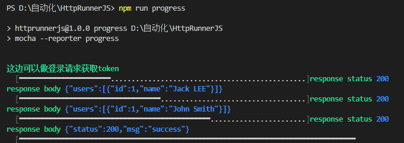

# HttpRunnerJS

JavaScript restful API 单元测试框架


recommend: [China-Gitee](https://gitee.com/liyinchi/HttpRunnerJS)，[Other-Github](https://github.com/Musule/HttpRunnerJS)


## 支持http、https、socket、websocket协议

## 一、安装

1.下载Nodejs

>https://npm.taobao.org/mirrors/node/v0.12.13/


2.安装所有依赖
```
npm install
```

### 客户端

请求脚本示例

#### client-http.js

```JavaScript
it("GET The second format", () => {
        // Mocking a GET request
        Mock.onGet("/users", { params: { searchText: "John" } }).reply(200, {
            users: [{ id: 1, name: "John Smith" }],
        });
        // send a GET request
        axios({
            "url": "/users",
            "method": "get",
            "params": { searchText: "John" }
        }).then(response => {
            console.log(response.data);// 获取响应体
        }).catch(err => {
           console.error(err)
        })
    })
```


#### client-websocket.js

```JavaScript
        client.on('connect', function (connection) {
            // websocket 客户端连接成功后
            console.log('WebSocket Client Connected');
            // websocket 客户端发生错误时
            connection.on('error', function (error) {
                console.log("Connection Error: " + error.toString());
            });
            // websocket 客户端连接关闭后
            connection.on('close', function () {
                console.log('echo-protocol Connection Closed');
            });
            // websocket 客户端连接关闭后
            connection.on('message', function (message) {
                if (message.type === 'utf8') {
                    console.log("Received: '" + message.utf8Data + "'");
                }
            });
            function sendNumber() {
                if (connection.connected) {
                    var number = Math.round(Math.random() * 0xFFFFFF);
                    connection.sendUTF(number.toString());
                    setTimeout(sendNumber, 1000);
                }
            }
            sendNumber();
        });
        // 客户端发起websocket请求
        client.connect('ws://localhost:8080/', 'echo-protocol');
```

* 配合client-websocket.js示例，启动本地websocket服务
```bash
node server/server-websocket.js
```



#### client-socket.js
```JavaScript
 it("socket emit", () => {
        var socket = require('socket.io-client')('http://127.0.0.1:4004/');
        // 发生连接时
        socket.on('connect', ()=>{
                console.log("connect sever success")
        });
        // 客户端触发服务端event事件
        socket.emit('Client2Server', '这是发送给服务端的数据',()=>{// 触发事件
           console.log("客户端把数据发给服务端");
        });
         // 绑定event事件
        socket.on('Server2Client', (data)=>{// 绑定事件
            console.log(`服务端把处理后的数据，传递给客户端，内容是：${data}`);
        });
        // 发生连接错误时
        socket.on('disconnect', ()=>{
            console.log(`disconnect`);
        });

    })
```

* 配合client-socket.js示例，启动本地socket服务

```bash
node server/server-socket.js
```

客户端

服务端


## 二、运行脚本

### (一) 运行指定脚本

命令行执行

#### http client request
```bash
./node_modules/.bin/mocha test/client-http.js --reporter mochawesome
```
#### socket client request
```bash
./node_modules/.bin/mocha  test/client-socket.js --reporter mochawesome
```
#### websocket client request
```bash
./node_modules/.bin/mocha  test/client-websocket.js --reporter mochawesome
```


### (二) 生成不同格式测试报告

html、json
---
```bash
npm run mochawesome
```


xml
---
```
npm run junit
```


allure
---
```
npm run allure
```


progress
---
```
npm run progress
```


## mocha 单元测试框架

>mocha是JavaScript 单元测试框架，相当于Java Junit、testNG

|参数名|功能|
|--|--|
|--recursive|执行除test直接目录下所有test文件|
|--reporter|输出报告类型，类型：mochawesome、dot、spec、tap、mocha-junit-reporter、|
|--watch|监控模式/常用于调试脚本|
|--timeout|超时设置毫秒 例如：--timeout 6000000|
|--bail|失败后中断|
|--growl|将测试结果在桌面显示|
|--grep|用于搜索测试用例的名称（即it块的第一个参数），然后只执行匹配的测试用例|

## 技术栈

>axios、mock、chalk、lowdb、socket.IO、websocket

